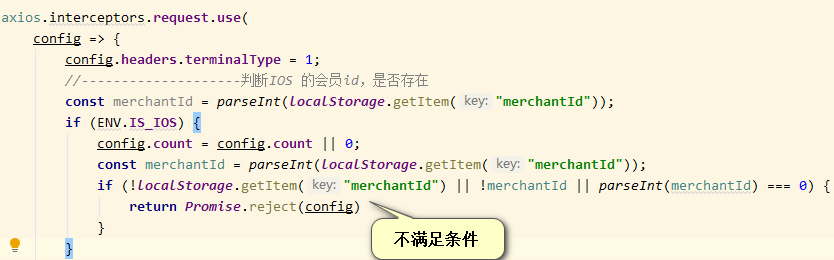
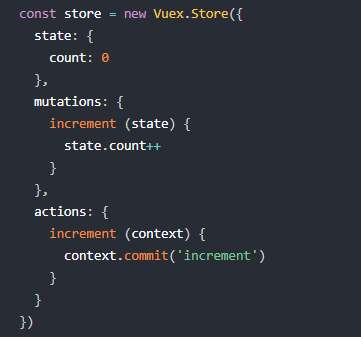

##### 总结平时所用知识
**axios 当不满足条件时延时并重复发送请求**
  
>>要点 当不满足条件时， return Promise reject(err) err 为config 在返回结果劫持错误时，限制错误，并重复发送请求
>>> 

***

**mutations里的方法名尽量用大写**
 -如 export const STORE_DATA='STORE_DATA'
 -想改变state里的状态值，必须用store.commit改变mutation的handler,mutation是直接提交，
    action提交mutation。
>>  

####常用基础scss在common-scss文件夹

####渐变颜色在gradual-color 文件夹
    
        

